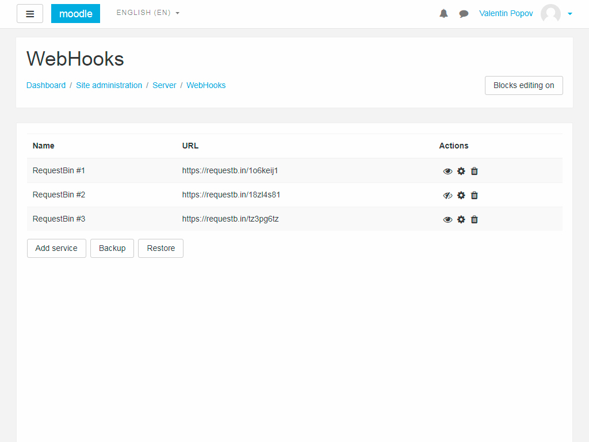
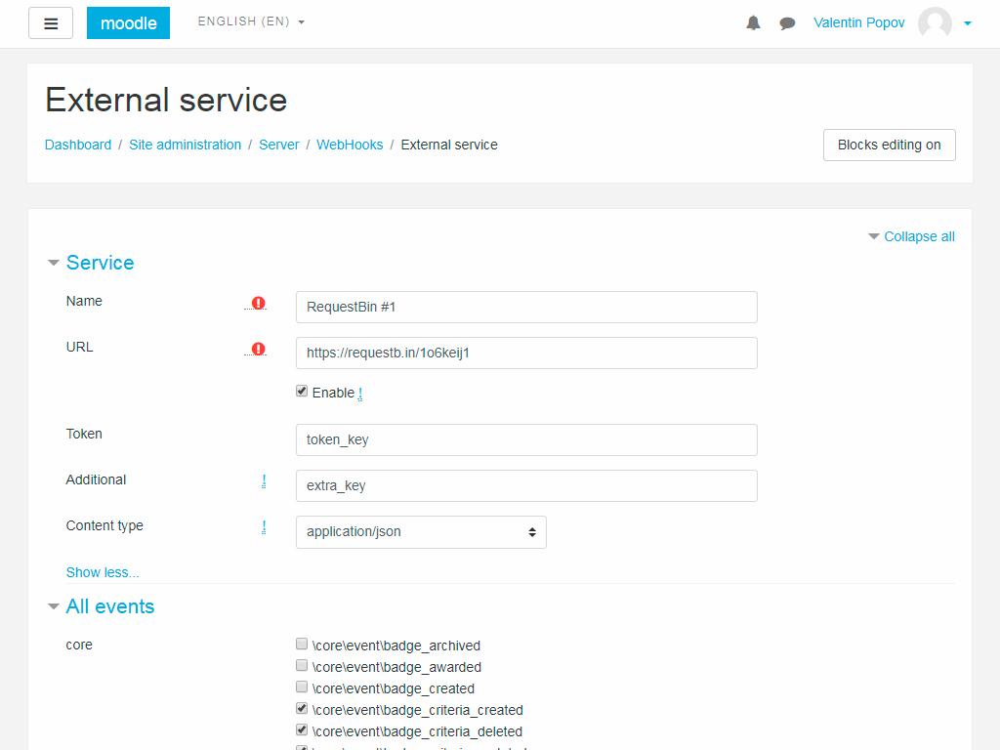

# Getting Started

## Navigation

* Installation
    * Build
* User guide
    * Guide to the manager
    * Guide to the editor
* Request format

## Installation

Get the installation package in any of the available methods:

* [GitHub Releases](https://github.com/valentineus/moodle-webhooks/releases).
* [Compilation from the source code](#build).

### Build

Self-assembly package is as follows:

* Clone the repository:
```bash
git clone https://github.com/valentineus/moodle-webhooks.git moodle-webhooks
```

* Run the build script:
```bash
cd ./moodle-webhooks
/bin/sh build.sh
```

## User guide

After you install the plug-in, the Service Manager appears on the `Server` tab in the administration panel.

To open the page, go:
`Site administration` ->
`Server` ->
`WebHooks`.

### Guide to the manager

The main window looks like this:



On the main page you can see the list of services and manage each service separately.

Column description
* "**Name**" shows the name of the service.
* "**URL**" indicates the address of the service to which notifications are received.
* "**Actions**" allows you to enable / disable the service, edit and delete.

Description of control buttons:
* "**Add service**" opens a page for creating a new service.
* "**Backup**" loads the backup file of the service list.
* "**Restore**" redirects the data recovery page from the backup.

### Guide to the editor

During the editing and creation of the service, this page opens:



The field "**Name**" stores an arbitrary name for the service

The "**URL**" field stores the address of the service to which notifications will be sent as a POST request.

The "**Token**" field allows you to specify an individual key that will allow an external service to identify requests.

The "**Advanced**" field stores a large string passed to the service.
This can be useful for some services or users.

The "**Content Type**" field allows you to configure the type of outbound requests if there are compatibility issues.

The "**All events**" list contains a list of all events registered in the system.
The selected events will notify the service.

## Request format

Events come in
[JSON](https://en.wikipedia.org/wiki/JSON)
format.

An example of an observed course event:

```JSON
{
    "eventname": "\\core\\event\\course_viewed",
    "component": "core",
    "action": "viewed",
    "target": "course",
    "objecttable": null,
    "objectid": null,
    "crud": "r",
    "edulevel": 2,
    "contextid": 2,
    "contextlevel": 50,
    "contextinstanceid": "1",
    "userid": "2",
    "courseid": "1",
    "relateduserid": null,
    "anonymous": 0,
    "other": null,
    "timecreated": 1512961456,
    "host": "localhost",
    "token": "",
    "extra": ""
}
```

[Detailed description of the fields](https://docs.moodle.org/dev/Event_2#Properties).